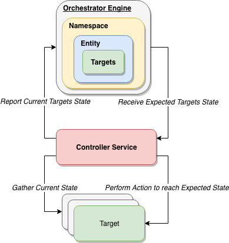

# Orchestrator Engine

Provides orchestration capabilities with automatic rollback for a batch of targets



## Namespace

---
A Namespace is defined as virtual engine composed of many entities, typically helps to isolate test,dev,prod entities

## Entity

---
An Entity is defined as a group of targets that needs an action to be performed or something which needs to be upgraded. Example of an entity is

* Application/Configuration, service/deployment which needs to be upgraded from old(v1) to new(v2)

* Operation, example would be a restart operation

## Target

---
A Target is defined as something which requires an action to be performed. Example of a target would be something which requires

* Version update, from old (v1) to new (v2)

* Modifying Target state, example is modifying configuration on a VM

## Controller Service

---
A Controller Service is defined as something which performs regular/one time actions on targets. Example of this service is

* Application/Configuration version updating service, which rolls out new version on targets, moving from old (v1) to new (v2)

* Controller Service performing restart action on fixed number of targets

## Performing Orchestration

---

* Import orchestrator

```go
import "github.com/nixmade/orchestrator/core"
```

* Create a new orchestration engine

```go
config := core.NewDefaultConfig()
engine := NewOrchestratorEngine(config)
```

* Set TargetVersion and RolloutOptions (optional), this creates namespace and entity

```go
namespaceName := "production"
entityName := "app-service"
options := &core.RolloutOptions{
   BatchPercent:        10,
   SuccessPercent:      100,
   SuccessTimeoutSecs:  900,
   DurationTimeoutSecs: 3600,
  }
// Creates defailt rollout options, first call always creates namespaceName and entityName
if err := engine.SetRolloutOptions(namespaceName, entityName, options); err != nil {
    return nil, nil, err
}
// Sets TargetVersion as v1
if err := engine.SetTargetVersion(namespaceName, entityName, EntityTargetVersion{Version: "v2"}); err != nil {
    return nil, nil, err
}
```

* Create set of Targets to report its current state

```go
var currentClientTargets []*ClientState
storedTargetState := make(map[string]string)
for i := 0; i < numTargets; i++ {
    clientTarget := &ClientState{
        Name:    fmt.Sprintf("clientTarget%d", i),
        Version: "v1",
        Message: "running successfully",
        IsError: false,
    }
    currentClientTargets = append(currentClientTargets, clientTarget)
    storedTargetState[clientTarget.Name] = clientTarget.Version
}
```

* Controller Service reports the current state of all the targets in an entity, returns expected state by updating clientTargets

```go
expectedClientTargets, err := engine.Orchestrate(namespaceName, entityName, clientTargets)
if err != nil {
    return err
}
```

* Controller Service performs needed actions if orchestrator reports such

```go
targetVersion := "v2"
for _, clientTarget := range expectedClientTargets {
    if clientTarget.Version != storedTargetState[clientTarget.Name] {
        //update target to version v2/perform restart/rollback
    }
}
```

* Get current rollout info to check if rollout is going forward or rolling back by checking Last Known Good or Last Known Bad versions

```go
rolloutState, err := engine.GetRolloutInfo(namespaceName, entityName)
if err != nil {
    return err
}

if rolloutState.LastKnownGoodVersion == "v2" {
    // Success stop calling orchestrator
}

if rolloutState.LastKnownBadVersion == "v2" {
    // New version is bad start rolling back
    // Which is calling the orchestrator again which rolls back upgraded targets
    targetVersion = rolloutState.LastKnownGoodVersion
}

```

## Note

* Versions are case sensitive, example v1 != V1
